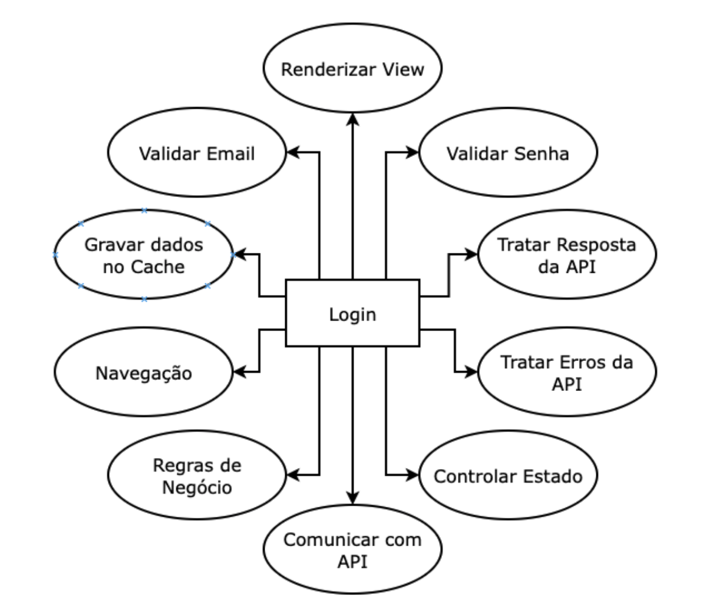
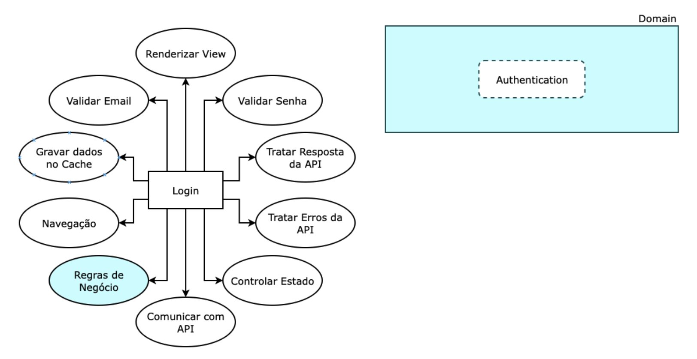
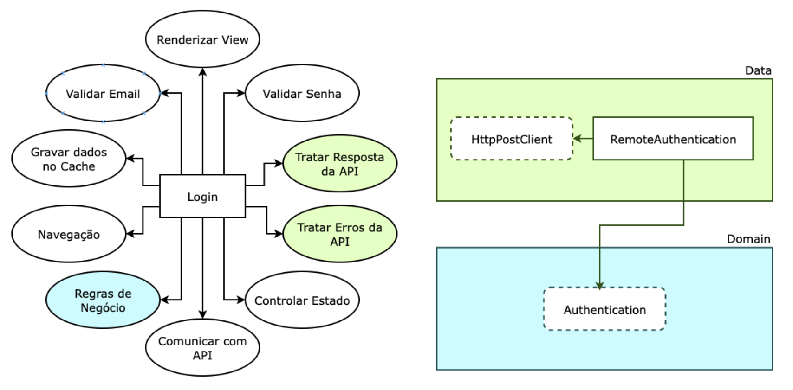
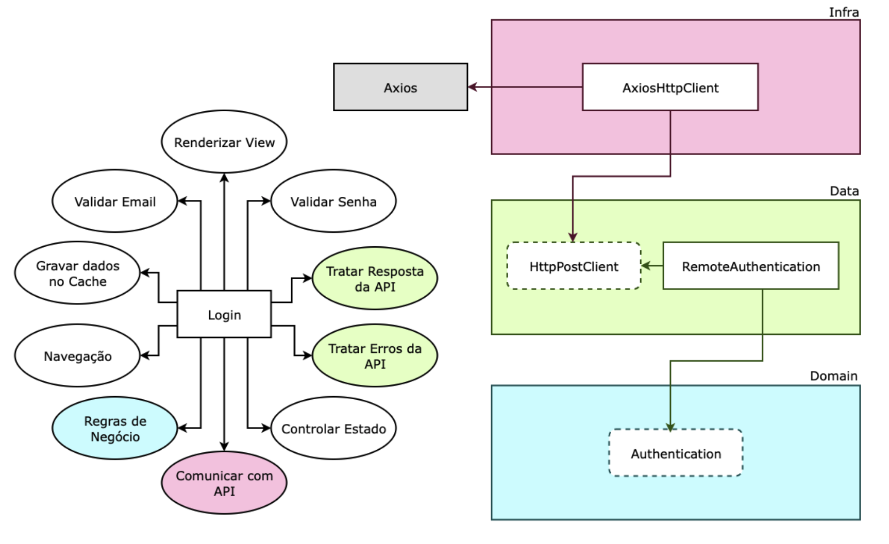
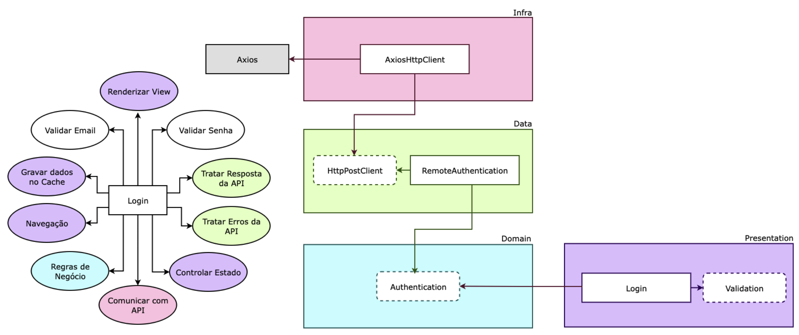
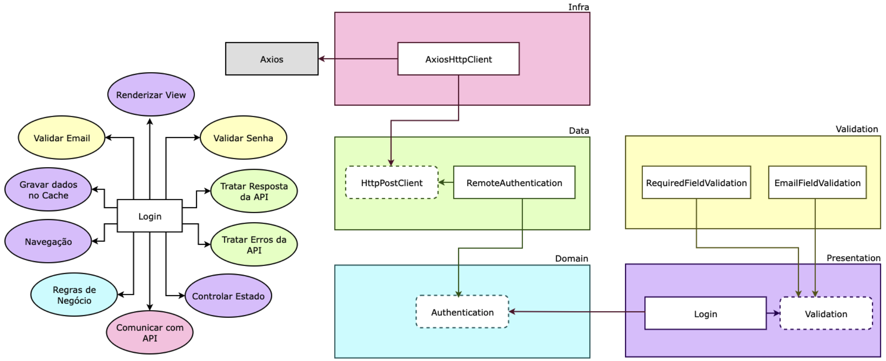
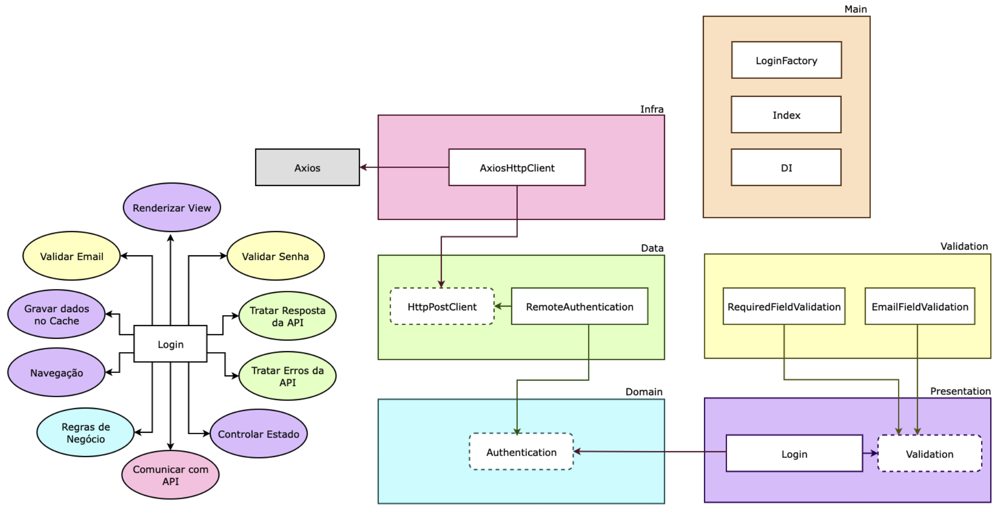

# Introdução ao Diagrama de Responsabilidades

Imagine que estamos lidando com um cenário comum em projetos React: uma tela de login. O React oferece uma facilidade incrível com seus Hooks e simplicidade, permitindo que você realize diversas tarefas diretamente dentro do componente do React.
No entanto, quando visualizamos essa abordagem em um diagrama, torna-se evidente que estamos sobrecarregando o componente de Login. Ele acaba assumindo várias responsabilidades, como gerenciamento de estados, requisições HTTP, validações e muito mais.

Aqui, podemos ver claramente como o componente de Login está sendo forçado a lidar com uma carga excessiva de responsabilidades.
A essência da programação reativa sugere que um componente React deve ter como única responsabilidade a programação reativa. No entanto, frequentemente incluímos muitas outras tarefas nesse componente, devido à facilidade de implementação.
Embora essa abordagem inicial possa parecer mais rápida e conveniente, ela vem com desvantagens significativas, como dificuldade na manutenção, código desorganizado e desafios na realização de testes, entre outros.
Agora, vamos explorar uma arquitetura que pode nos ajuda a reorganizar nossas responsabilidades de maneira mais eficiente, garantindo que nosso componente de Login mantenha seu foco na programação reativa.

## Camada de Domínio: Regras de Negócio

- Na nossa arquitetura, a camada de domínio é onde residem nossas regras de negócio, como a autenticação em nosso exemplo.
- Importante ressaltar que a camada de domínio não é uma classe em si, mas sim uma representação de interfaces.
- O objetivo da camada de domínio é definir essas regras de negócio por meio de interfaces.
- Por exemplo, para a classe de autenticação, especificamos que ela requer um e-mail e uma senha para autenticação, e que isso resultará na obtenção de um token de acesso.
- A camada de domínio foca exclusivamente na lógica da autenticação, sem se preocupar com detalhes de implementação, como se a autenticação ocorrerá no banco de dados, por meio de uma API ou acessando dados locais no localstorage.

Dessa forma, mantemos as regras de negócio independentes de qualquer implementação específica.

## Camada de Data: Implementação dos Casos de Uso

- Na camada de Data, concentramos as implementações práticas de nossos casos de uso.
- Um exemplo prático é a autenticação, que pode ser implementada utilizando uma API externa, como nossa própria API de ecossistema (para fins de teste).
- Nesta camada, criamos implementações concretas das interfaces previamente definidas na camada de Domínio.
- Para facilitar a identificação, é comum nomear as classes de acordo com o tipo de implementação. No caso da autenticação via API, podemos chamá-la de `RemoteAuthentication`.
- Importante notar que a camada de Data depende exclusivamente da camada de Domínio, mantendo um fluxo claro de dependência.
- Para evitar acoplamento direto à biblioteca de requisições HTTP (como Axios ou Fetch), criamos uma interface dentro da camada de Data. Esta interface desacopla a implementação do caso de uso da biblioteca de requisições.
- É fundamental compreender que na camada de Data, estamos focados apenas no fato de que precisamos de um cliente que faça uma chamada POST. Não nos importa como ele realiza esse POST, quem o executa ou os detalhes de implementação.
- Os detalhes sobre como efetuar essa chamada POST são definidos em uma camada externa chamada `infra`, permitindo que essa parte da lógica seja configurada e alterada de forma independente.

Dessa forma, garantimos a flexibilidade de trocar a biblioteca de requisições no futuro, sem afetar os casos de uso implementados.

### Camada de Infra: Implementações de Frameworks Externos

- A camada de Infraestrutura (ou Infra) é onde residem as implementações que geralmente envolvem o uso de frameworks externos.
- No nosso caso, precisamos de um cliente que saiba realizar requisições POST, e para isso, estamos utilizando o Axios.
- Aqui, estamos realmente implementando o protocolo de uso do POST que criamos na camada de Data.
- Vários casos de uso dependem desse protocolo definido pela interface `HttpClient`. Qualquer caso de uso que necessite realizar uma requisição POST terá uma dependência dessa interface, que é, na verdade, uma abstração.
- A implementação concreta dessa abstração é realizada na camada de Infra.
- É importante notar que a camada de Infra só conhece a camada de Data, e esta é a única dependente dela.
- A camada de Data, por sua vez, depende do Domínio.
- A ideia fundamental é que o Domínio seja completamente independente, ou seja, não dependa de nenhuma outra camada.

Dessa forma, seguimos o princípio de isolamento de responsabilidades e garantimos que a lógica de negócios (Domínio) permaneça desacoplada de implementações técnicas específicas, como o uso do Axios para requisições POST.

## Camada de Presentation: Componente Principal - Login

- A camada de Presentation é a interface do nosso sistema, e nela temos o componente principal, que é o Login.
- A ideia central aqui é que o Login dependa diretamente do caso de uso de Autenticação do Domínio. Isso significa que o Domínio permanece independente, como podemos ver pelas setas sempre entrando nele e nunca saindo.
- O Domínio é a espinha dorsal da Clean Architecture, porque é onde residem as regras de negócio principais.
- Na camada de Presentation, conhecemos apenas a abstração da autenticação. Em outras palavras, dependemos de alguém que nos forneça uma classe que implemente concretamente esse protocolo.
- Isso nos dá a flexibilidade de criar várias implementações para esse protocolo e escolher qual usar no nosso componente de Login ou outros componentes futuros.
- Além disso, mais a frente vamos criar uma camada intermediária chamada "Main" que faz a composição desses objetos de implementação. O Login recebe o protocolo como uma interface, mas precisamos de uma classe concreta para efetivamente lidar com a autenticação.
- No entanto, não pegamos essa classe diretamente no Login, porque não queremos acoplar o componente de Login a uma classe concreta. Em vez disso, o componente de Login se concentra exclusivamente nas lógicas relacionadas ao React, como renderização de view, armazenamento de dados em cache, navegação e gerenciamento de estados da tela.

Essa abordagem mantém a separação de responsabilidades e garante que o componente de Login permaneça desacoplado de implementações específicas.

## Camada de Validation: Desacoplando a Lógica de Validação

- Embora seja tentador incorporar a lógica de validação diretamente nos componentes React, como usar o Formik ou o React Hook Form para criar rapidamente esquemas de validações, essa abordagem pode comprometer a reutilização do componente.
- Se acoplarmos as validações diretamente ao componente, qualquer mudança de framework, como trocar do React para o Angular ou VueJS, exigiria uma reescrita significativa da lógica de validação.
- Para manter nossa arquitetura limpa e desacoplada, introduzimos uma camada de validação chamada `Validation`.
- Nessa camada, definimos validações específicas, como `EmailFieldValidation` e `RequiredFieldValidation`.
- O componente de Login dependerá de uma abstração chamada `Validation` e não de implementações específicas de validação.
- A abstração `Validation` é definida na própria camada de Presentation, onde especificamos as regras que devem ser aplicadas, como a necessidade de um campo receber parâmetros específicos (x e y) e retornar um resultado específico (Z).
- Quem for responsável por realizar a validação deve aderir a esse protocolo definido na camada de Presentation.
- Todos os validadores criados na camada de `Validation` implementarão esse protocolo, tornando-os trocáveis.
- Para gerenciar múltiplos validadores no componente de Login, usamos um design pattern chamado de Composite. Vamos criar um `ValidationComposite` que é responsável por compor todos esses pequenos validadores em um único conjunto de regras de validação.
- O Composite permite que injetemos um conjunto de validadores no componente de Login para validar todos os critérios necessários, como campos obrigatórios, formato de e-mail válido e requisitos de senha, sem acoplar o componente a implementações específicas de validação.

Essa abordagem garante que o componente de Login permaneça flexível e independente, facilitando futuras alterações e garantindo a reutilização em diferentes contextos e frameworks.

## Camada de Main: Compondo a Aplicação

- A camada de Main é a última camada em nossa arquitetura e ela depende de todas as outras camadas. Nossa arquitetura respeita estritamente essa hierarquia de dependência entre camadas.
- Para recapitular, a camada de Infra depende apenas do Data, o Data depende do Domínio, o Validation depende do Presentation e o Presentation depende do Domínio. O Domínio permanece isolado e independente de todas as outras camadas.
- Agora, como fazemos para que nossa aplicação realmente funcione? O ponto de entrada da nossa aplicação é o Login. No entanto, o Login depende de diversas abstrações, como Validation e Authentication. Essas abstrações são interfaces e precisamos de implementações concretas para que tudo funcione.
- Por exemplo, o `RemoteAuthentication` requer um `HttpClient`, que é uma interface. Portanto, precisamos de uma implementação concreta dessa interface.
- Aqui é onde entra a camada de Main. Utilizamos design patterns como factories, que são classes responsáveis por criar instâncias de outras classes. Em nosso caso, temos um `LoginFactory` que gerencia todas as dependências necessárias para a tela de Login funcionar, incluindo EmailFieldValidator, RequiredFieldValidator, RemoteAuthentication, e assim por diante.
- Esse design pattern é conhecido como "composition root" (raiz de composição), o que significa que a camada de Main agrega todas as outras camadas para desacoplar o restante do sistema. Estamos dispostos a sacrificar a simplicidade da camada Main para manter o restante do sistema limpo e modular.
- Na camada de Main, podemos encontrar factories, adapters, builders e outros componentes responsáveis por montar o quebra-cabeça da nossa aplicação.
- Além disso, estamos utilizando o design pattern de injeção de dependência. Isso significa que não criamos instâncias de nossas dependências diretamente dentro do componente de Login. Em vez disso, dependemos de uma abstração e alguém injeta as implementações concretas na nossa classe. O `LoginFactory` é responsável por realizar essa injeção de dependência de maneira adequada.

Essa abordagem permite que a aplicação permaneça flexível, desacoplada e facilmente extensível, facilitando futuras alterações e manutenção do sistema.

## Conclusão

Nesta arquitetura, aplicamos vários princípios do SOLID para garantir e flexibilidade do nosso sistema.

- **Dependency Inversion Principle (Princípio da Inversão de Dependência)**: O nosso design segue o DIP, pois dependemos de abstrações em vez de implementações concretas. Isso permite que injetemos facilmente dependências em nossos componentes, promovendo uma maior flexibilidade e testabilidade.
- **Single Responsibility Principle (Princípio da Responsabilidade Única)**: Inicialmente, tínhamos um componente de Login com várias responsabilidades. No entanto, quebramos essas responsabilidades em camadas distintas, cada uma com uma responsabilidade única. Isso mantém nosso código coeso e facilita a manutenção.
- **Open-Closed Principle (Princípio do Aberto/Fechado)**: Aplicamos o OCP de maneira eficaz, pois nossa arquitetura permite a extensão de funcionalidades sem a necessidade de modificar o código existente. Isso pode ser alcançado, por exemplo, por meio do uso de decorators, que nos permitem adicionar funcionalidades a objetos existentes sem alterá-los diretamente. Um cenário de uso em nosso exemplo poderia ser a implementação de um decorator para incluir automaticamente o token de acesso do usuário logado em todas as requisições autenticadas, sem alterar a lógica do `HttpClient` original.

Esses princípios do `SOLID` são essenciais para criar uma arquitetura robusta, de fácil manutenção e expansível.
