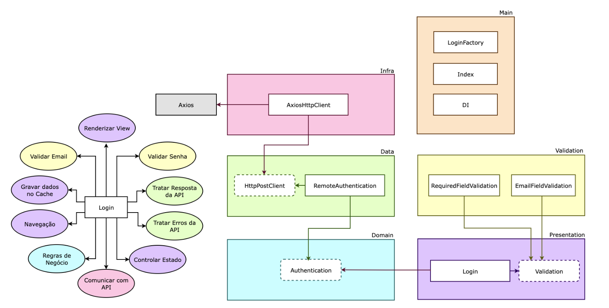

# React + Clean Architecture

O objetivo desse repositorio é mostrar como criar um sistema em ReactJs utilizando os novos Hooks, Recoil, com uma arquitetura bem definida e desacoplada, utilizando TDD (programação orientada a testes) como metodologia de trabalho, Clean Architecture para fazer a distribuição de responsabilidades em camadas, sempre seguindo os princípios do SOLID, DRY, YAGNI, KISS e aplicando Design Patterns para resolver alguns problemas comuns.
  

> ## Princípios

- Single Responsibility Principle (SRP)
- Open Closed Principle (OCP)
- Liskov Substitution Principle (LSP)
- Interface Segregation Principle (ISP)
- Dependency Inversion Principle (DIP)
- Separation of Concerns (SOC)
- Don't Repeat Yourself (DRY)
- You Aren't Gonna Need It (YAGNI)
- Keep It Simple, Silly (KISS)
- Composition Over Inheritance
- Small Commits

> ## Design Patterns

- Factory
- Adapter
- Composite
- Decorator
- Dependency Injection
- Composition Root
- Builder
- Proxy

> ## Architecture

